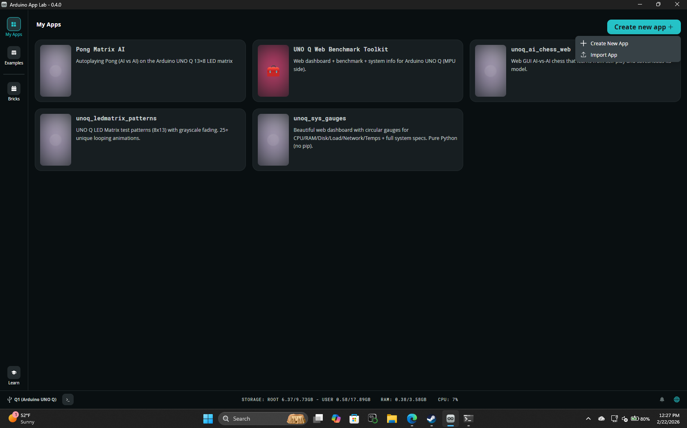

# Arduino UNO Q — Arduino App Lab Project Collection

This repository bundles **importable Arduino App Lab projects** as `.zip` files, so anyone can quickly load them into Arduino App Lab without digging through folders.

> **Note:** Your Arduino App Lab “My Apps” screen may contain **more projects than the ones listed here** (and more than the screenshot).  
> This repo includes **only the app zips provided in this package**.

## Included projects

The importable `.zip` files live in: [`apps/`](apps/)

| App | Import ZIP |
|---|---|
| Pong Matrix AI | `apps/Pong Matrix AI.zip` |
| UNO Q Web Benchmark Toolkit | `apps/UNO Q Web Benchmark Toolkit.zip` |
| unoq_ai_chess_web | `apps/unoq_ai_chess_web.zip` |
| unoq_ledmatrix_patterns | `apps/unoq_ledmatrix_patterns.zip` |
| unoq_sys_gauges | `apps/unoq_sys_gauges.zip` |

## How to import into Arduino App Lab

1. Open **Arduino App Lab**
2. Go to **My Apps**
3. Click **Create new app +**
4. Click **Import App**
5. Select one of the `.zip` files from this repo’s `apps/` folder

### Screenshot (where “Import App” is)

## Tips / troubleshooting

- **Do not unzip** the project zip before importing — Arduino App Lab expects the `.zip` as-is.
- If an import fails, try:
  - Re-downloading the `.zip`
  - Importing a different app zip (to confirm App Lab is working)
  - Updating Arduino App Lab to the latest version you have available

## Integrity checks (optional)

SHA-256 hashes for the included zips:

- `Pong Matrix AI.zip` — `sha256:6d6f14c5bb77e15346a300976ac12f22d724bc9c2ebf1e9802fe5f789afa8459`
- `UNO Q Web Benchmark Toolkit.zip` — `sha256:d57424116a71077dcce6a5bfaffb0b7b0167c2689bbcdf227ab83a6cdcf1d41c`
- `unoq_ai_chess_web.zip` — `sha256:6a25563d36235ac3acc6c8add90873d9a059c5c7757982d065f0abe31c5c4c45`
- `unoq_ledmatrix_patterns.zip` — `sha256:c4c3cd1df0f7257a06cf31ed8840157848ed491daba0a641f6d74b3b795580bb`
- `unoq_sys_gauges.zip` — `sha256:3e88c7b854b1e63606c7e1fa34b6cc7b2247018c37ba48efeebf1e198798b586`

## License

Unless otherwise noted inside each imported project, this repository is shared under the MIT License (see [`LICENSE`](LICENSE)).
